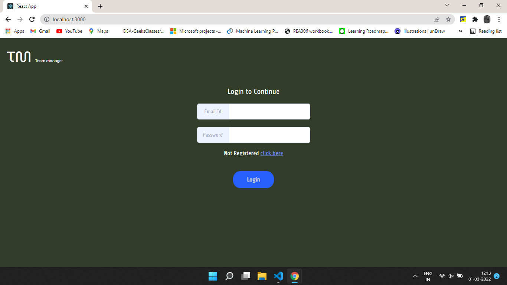
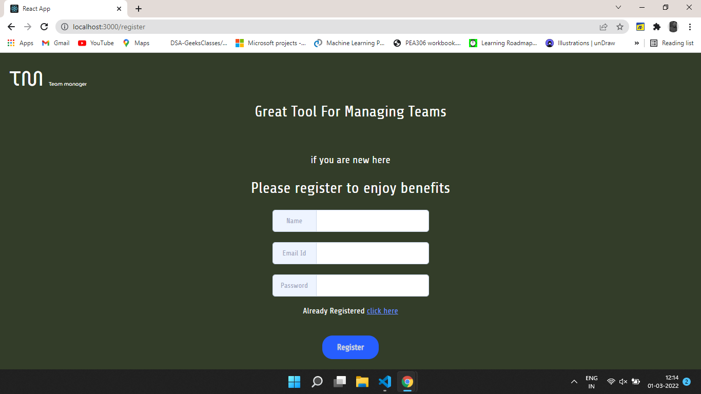
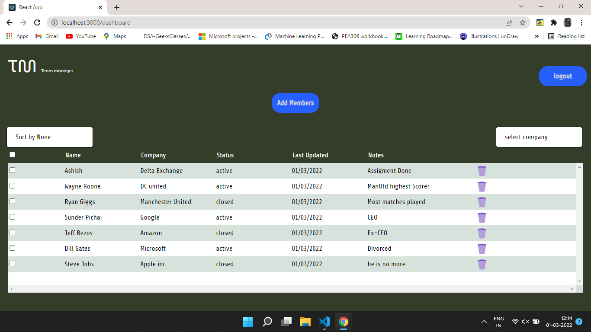

# Team manager

This is a small Team manager web app where you can manage team member.

``` Key Feature ```

1. You can Add Team Member
2. You can Delete Team Member
3. you can Sort Team member based on Active or Closed
4. Also you can Filter Team member table using multiselect dropdown checkbox
5. Also you can create Account and have Login Logout Feature
6. Different routes for SignIn , SignUp , Dashboard.

``` Technology Used ```

```
React,Redux-toolkit, Firebase Authentication, Firebase Realtime Storage , Axios
```
1. Axios use for Fetching,Sending,Deleting Team data from Firebase realtime Storage
2. Firebase authentication use for create user account for login in the app
3. Redux use for state management of user data and team data.

``` Able to implement ```

1. SignIn & SignUp Mechanism
2. Add Member , Delete Member, Sort Member by  Active or Closed.
3. User can filter Team data using company from drop down.


``` Not able to implement  ```
1. I am not able to add select all feature in company filter dropdown.
But in future i will definitely learn those multiselect dropdown feature.
2. Form Validation not fully
3. Route validation Not fully 

    
    ``` 
    May be there will be some bugs as well
    ```
    
 ```
 Login Credential :
 
 Email Id : test@gmail.com
 Password : 123456
 
 ```
    
    
``` Login Page ```



``` SignUp page ```



```Dashboard ```



[Project Demo Live Link ](https://team-manager-web.netlify.app)

[Project Github Repo ](https://github.com/ASHISH7865/Team-manager-web-app)